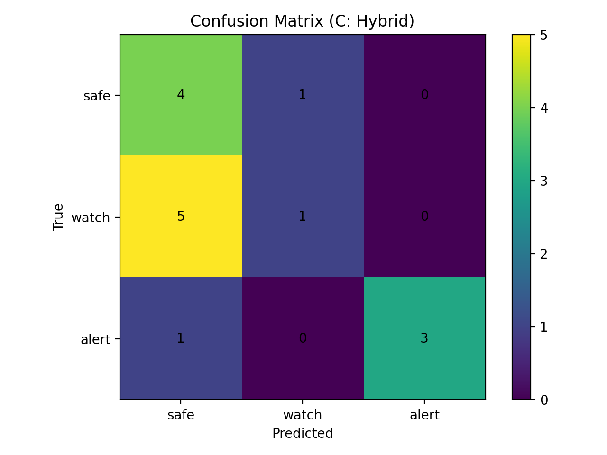
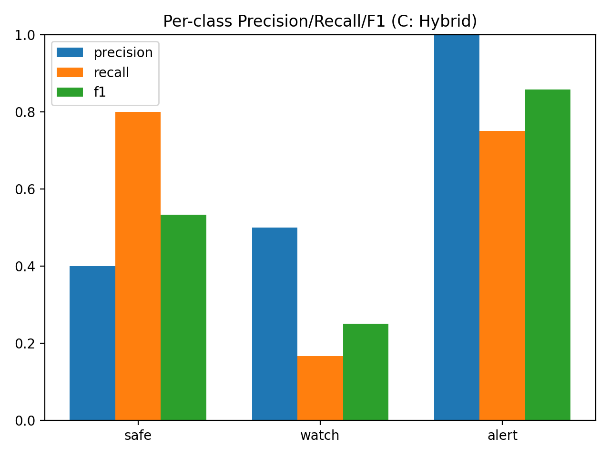
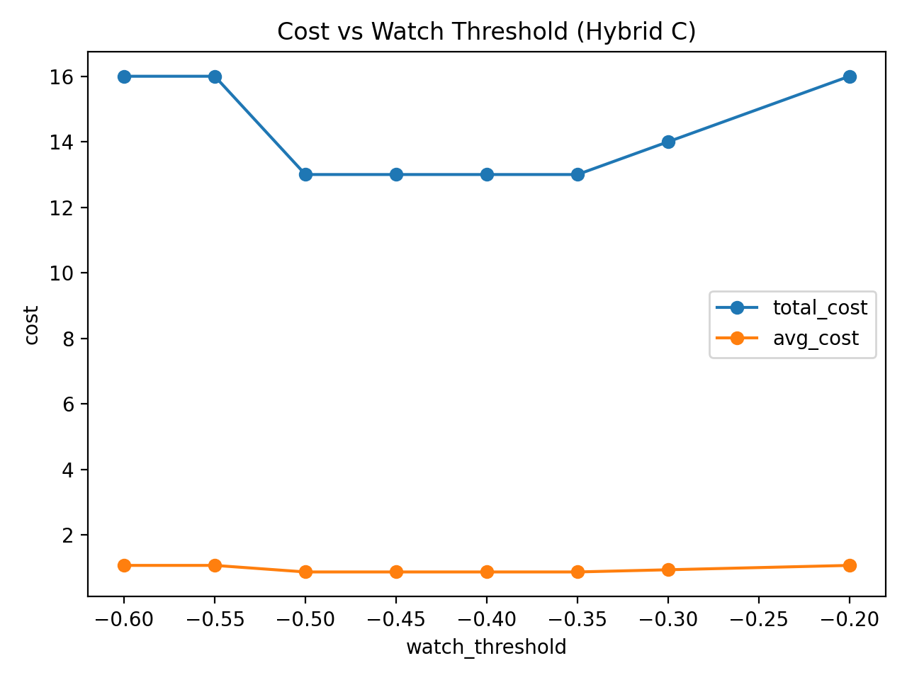
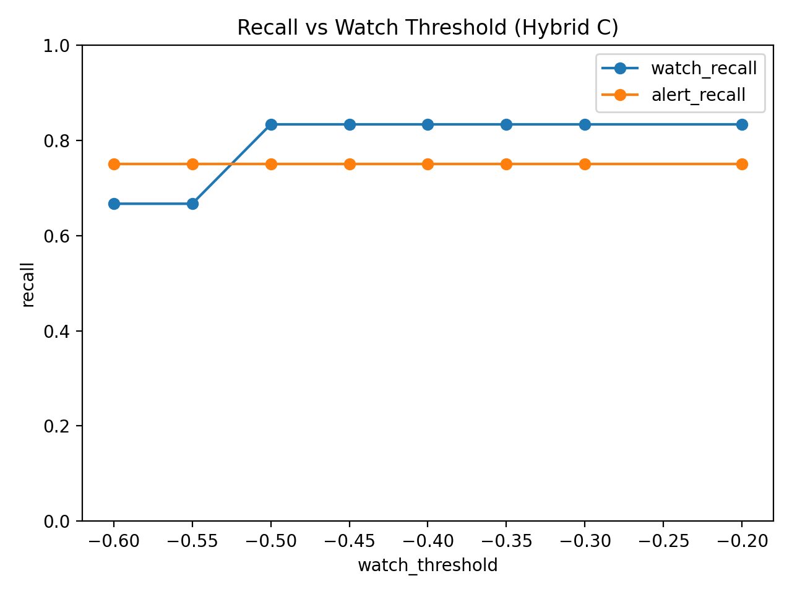

# Mini-Vibes (Local Research Prototype)

A local, reproducible research prototype that explores **explainable risk flagging**
for middle-school student check-ins.

Students select an emotion and write a short journal entry.  
The system produces:

- a lightweight sentiment score
- an explainable **risk level** (`safe` / `watch` / `alert`)
- human-readable reasons for each flag (non-diagnostic)

**Important**  
This project uses **synthetic data only** and is **not a medical or clinical tool**.
It is intended for research, experimentation, and system design exploration.

---

## Overview

This repository studies a **rule-based, explainable baseline** for detecting
potential emotional risk in short youth journal entries.

Rather than maximizing raw accuracy, the system prioritizes:

- interpretability
- conservative flagging
- class-aware and cost-aware evaluation

The goal is to demonstrate how different signal sources contribute to risk detection
and why **accuracy alone is insufficient** in safety-critical domains such as
school mental-health support.

---

## Inputs and Outputs

### Inputs
- `emotion_hint`  
  A self-reported emotion selected from an emotion wheel (may be missing).
- `text`  
  A short journal-style entry (1–2 sentences).

### Outputs
- `sentiment_score` in range `[-1.0, 1.0]`
- `risk_level`: `safe`, `watch`, or `alert`
- `flags`: triggered signals from analyzer and rule engine
- `explanation`: human-readable reasons
- `suggested_action`: non-diagnostic next step

Example CLI output:

```json
{
  "emotion": "sad",
  "sentiment_score": -0.68,
  "risk_level": "watch",
  "flags": ["negative_cues_cluster"],
  "explanation": [
    "Multiple negative cues detected in the journal text."
  ],
  "suggested_action": "Recommend monitoring and a supportive check-in if patterns continue."
}
```

---

## Reproducibility (Local)

### Environment setup
```bash
python3 -m venv .venv
source .venv/bin/activate
pip install -r requirements.txt
```

### Run interactive CLI
```bash
python -m app.cli
```

### Run experiments (A / B / C baselines)
```bash
python -m src.run_experiments
```

### Run tests
```bash
pytest -q
```

All results are generated **locally** with no cloud dependencies.

---

## Dataset

- Synthetic corpus: `data/youth_corpus.csv`
- Annotation guidelines: `data/README.md`

### Risk labels
- **safe**: Normal emotional expression, no concern.
- **watch**: Negative or concerning tone that may require monitoring.
- **alert**: Language that should trigger **human review**, not automated decisions.

---

## Experiments

Three baselines are evaluated on the same corpus:

- **A — Emotion-only**: Uses only the selected emotion (no text).
- **B — Text-only**: Uses lexicon-based sentiment and rules from text alone.
- **C — Hybrid**: Combines emotion + text + explainable rule engine.

---

## Results Summary (n = 15)

| Experiment | Accuracy | Macro-F1 | Watch Recall | Alert Recall |
|----------|----------|----------|--------------|--------------|
| A Emotion-only | 0.667 | 0.509 | 1.000 | 0.000 |
| B Text-only | 0.533 | 0.482 | 0.000 | 0.750 |
| C Hybrid | 0.533 | 0.547 | 0.167 | 0.750 |

### Why accuracy is misleading

The emotion-only baseline achieves the highest accuracy, yet **fails to detect any
`alert` cases**. This highlights a key limitation of accuracy in safety-critical
settings: it does not reflect the severity of different error types.

Macro-averaged metrics and per-class recall provide a more informative view of system
behavior under class imbalance.

---

## Cost-Sensitive Evaluation

To better reflect real-world consequences, we evaluate each baseline using a
**cost-sensitive framework** in which different misclassifications incur different
penalties.

### Summary

| Experiment | Total Cost | Avg Cost |
|-----------|------------|----------|
| A Emotion-only | 33.0 | 2.20 |
| B Text-only | 28.0 | 1.87 |
| **C Hybrid** | **26.0** | **1.73** |

Although accuracy differences are modest, the hybrid system incurs the **lowest
overall risk cost**, indicating fewer high-severity failures (e.g., missed alerts).

A detailed discussion of the cost framework is provided in:
**[Cost_Sensitive_Eval](docs/COST_SENSITIVE_EVAL.md)** 

---

## Threshold Sensitivity Analysis

We further analyze how the **watch decision threshold** affects system behavior.
By sweeping the threshold across a range of values, we observe:

- **Alert recall remains stable**, indicating decoupling from watch sensitivity.
- **Watch recall decreases only when the system becomes overly conservative**.
- **Total cost exhibits a clear low-cost plateau**.

---

## Baseline Diagnostics (Hybrid C)

#### Confusion Matrix (Hybrid C)


#### Per-class Precision / Recall / F1


These plots summarize baseline classification behavior and are provided for diagnostic completeness.
The primary evaluation focus of this work is cost-sensitive and threshold-based analysis.

---

### Key finding

A stable low-cost region exists for:
```
watch_threshold ∈ [-0.35, -0.50]
```

Within this interval, the system minimizes total risk cost while maintaining
consistent alert detection.

### Visualizations

#### Cost vs Threshold


#### Recall vs Threshold


These curves illustrate the trade-off between missed risk and over-flagging,
and show how threshold selection encodes institutional risk tolerance.

---

## Ethics and Limitations

- This system performs **risk flagging**, not diagnosis.
- All outputs are intended for **human interpretation and review**.
- Data is synthetic and does not represent real individuals.
- Youth language includes sarcasm, slang, and contextual nuance that remain
  challenging for rule-based approaches.
- Results are illustrative rather than statistically generalizable.

---

## Project Structure

```
mini-vibes/
  app/                # CLI interface
  src/                # analyzer, engine, experiments
  data/               # synthetic corpus and annotation guide
  results/            # metrics and plots
  tests/              # unit tests
```

---

## License

This project is provided for educational and research purposes only.
